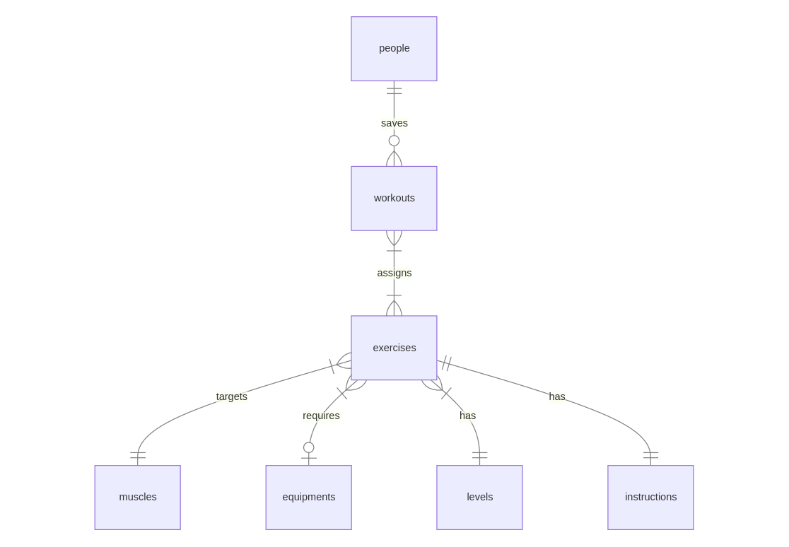

# Design Document

By Sahil Dowlani

## Scope

* The RBDMS chosen was SQLite as the concept  is appropriate for a local single user application.

* The database serves the purpose of facilitating workout planning for one and others by listing various exercises curated by the Ninjas Exercise API.

* Use case example: If one is a Personal Trainer, one can now create and administrate workouts for his clients!

* The main scope of the database includes but isn't limited to three entities:

    * people
    * exercises
    * workouts

* Basic Knowledge in topics such as the gym environment, equipments, muscle groups will further ease entity relations.

* Remains *outside* of the database's scope elements like the following:

    * Day-Time management i.e scheduling, reminders.
    * Tracking and Counting i.e calorie-tracking, rep-tracking, set-tracking.
    * Nutritional i.e meal planning, diet creation.
    * Geo-Location i.e finding or assigning gyms in your area.

## Functional Requirements

* The database supports:

    * CRUD Operations for all present entities.
    * Search for exercises using various categories such as muscle group, required equipment, difficulty level.
    * Search instructions for a determined exercise.
    * The user should be able to a build custom workouts by assigning exercises with totally customizable kg, sets and reps, may it be for himself or others.

* In this iteration it's not possible to:
    * Access the API's predefined workouts

## Representation
Entities are captured in SQLite with the following schema.

### Entities
The database includes the following entities:

#### People

The `people` table includes:

* `id` which specifies the unique identifier for the person in the database as an `INTEGER`. This column thus has the `PRIMARY KEY` constraint applied.
* `first_name` which specifies the person's first name as a `TEXT`. `TEXT` being the apropriate `TYPE` for naming fields.
* `last_name` which specifies the person's last name. `TEXT` is used with the same reasoning as `first_name`.
* `email` which specified the person's email adress. `TEXT` is used with the same reasoning as `last_name`. This column has the `UNIQUE` constraint applied ensuring no users have the same address.
* `number` which specifies the person's phone number. `TEXT` is used with the same reasoning as `email`. This column has the `UNIQUE` constraint applied ensuring no users have the same phone number.

#### Muscles

The `muscles` table includes:

* `id` which specifies the unique identifier for the muscle in the database as an `INTEGER`. This column thus has the `PRIMARY KEY` constraint applied.
* `name` which specifies the muscle's group name as a `TEXT`. `TEXT` being the apropriate `TYPE` for naming fields.

#### Equipments

The `equipments` table includes:

* `id` which specifies the unique identifier for the equipment in the database as an `INTEGER`. This column thus has the `PRIMARY KEY` constraint applied.
* `name` which specifies the equipment or machine name as a `TEXT`. `TEXT` being the apropriate `TYPE` for naming fields.

#### Levels

The `levels` table includes:

* `id` which specifies the unique identifier for the level in the database as an `INTEGER`. This column thus has the `PRIMARY KEY` constraint applied.
* `type` which specifies the level type as a `TEXT`. `TEXT` being the apropriate `TYPE` for naming fields.

#### Exercises

The `exercises` table includes:

* `id` which specifies the unique identifier for the exercise in the database as an `INTEGER`. This column thus has the `PRIMARY KEY` constraint applied.
* `name` which specifies the exercise name as a `TEXT`. `TEXT` being the apropriate `TYPE` for naming fields. This column thus has the `UNIQUE` constraint applied, exercise variants must be explicit in their naming.
* `muscle_id` which specifies the unique muscle identifier in the database as an `INTEGER`. This column thus has the `FOREIGN KEY`constraint applied referencing the `id`column in the `muscles` table.
* `equipment_id` which specifies the unique equipment identifier in the database as an `INTEGER`. This column thus has the `FOREIGN KEY`constraint applied referencing the `id` column in the `equipments` table.
* `level_id` which specifies the unique level identifier in the database as an `INTEGER`. This column thus has the `FOREIGN KEY`constraint applied referencing the `id` column in the `levels` table.

#### Instructions
The `instructions` table includes:

* `exercise_id` which specifies the unique exercise identifier in the database as an `INTEGER`. This column thus has the `FOREIGN KEY` constraint applied referencing the `id` column in the `exercises` table.
* `info` which specifies the actual instruction for the exercise as a `TEXT`.

#### Workouts
The `workouts` table includes:

* `id` which specifies the unique identifier for the workout in the database as an `INTEGER`. This column thus has the `PRIMARY KEY` constraint applied.
* `name` which specifies the workout name as a `TEXT`.
* `person_id` which specifies the unique person identifier in the database as an `INTEGER`. This column thus has the `FOREIGN KEY` constraint applied referencing the `id` column in the `people` table.

#### Assigns
The `assigns` table includes:

* `workout_id` which specifies the unique workout identifier in the database as an `INTEGER`. This column thus has the `FOREIGN KEY` constraint applied referencing the `id` column in the `workouts` table.
* `exercise_id` which specifies the unique exercise identifier in the database as an `INTEGER`. This column thus has the `FOREIGN KEY` constraint applied referencing the `id` column in the `exercises` table.
* `kg` which specifies the weight measurement to be executed as an `INTEGER`. This column's default value is `NULL`, when a value is specified the `CHECK` constraint assures that it is greater than 0.
* `sets` which specifies the group of repetitions to be executed. as an `INTEGER`. This column's default value is 3 as it is the most common value.
* `reps` which specifies the number of times to be executed as an `INTEGER`. This column's default value is 10 as it is the most common value.

### Relationships

The below entity relation diagram illustrates the relations between entities in the database.

As detailed by the diagram:
* `people` and `workouts` share a one-to-many relationship. A person can save none or multiple workouts, but a single workout can only be saved by one person.
* `workout` and `exercises` share a many-to-many relationship. A workout assigns multiple exercises, but an exercise may be assigned by multiple workouts.
* `exercises` and `muscles` share a one-to-many relationship. An exercise can only target one muscle, but a muscle may be targeted by multiple exercises.
* `exercises` and `equipment` share a zero-or-one-to-many relationship. An exercise might require an equipment, but an equipment may be required by multiple exercises.
* `exercises` and `levels` share a one-to-many relationship. An exercise has only one level, but a level may be in multiple exercises.
* `exercises` and `instructions` share a one-to-one relationship. Every exercise has an instruction and an instruction only belongs to one exercise.

## Optimizations

The optimizations present in this database are in the form of indexes and views, per the below:

* Indexes: speeds up common database tasks when consulting or discovering.
    * `exercise_name_search`
    * `instructions_information_search`
    * `workout_name_search`

* Views: joint tables meant to connect and ease data visualization for users.
    * `ExerciseDB` scopes `exercises`, `muscles`, `equipments`, `levels`, `instructions` this way discovering new exercises is a breeze, all relevant data in a singular place.
    * `WorkoutsDB` scopes `people`, `workouts`, `exercises`, `assigns`, this way tracking all saved workouts and its programs is simplified.

## Limitations

* In the current schema a workout is tailored exclusively to a person, the creation of  `Global` workouts which could be assigned to many people then isn't possible. `Global` workouts would require a shift to a many-to-many relation between people and workouts.

